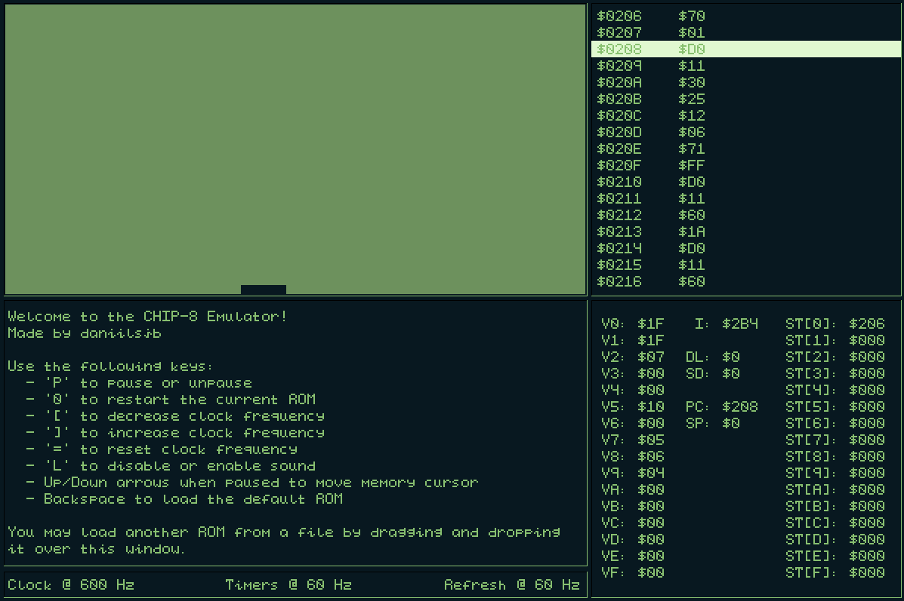

# CHIP-8 Emulator



[CHIP-8](https://en.wikipedia.org/wiki/CHIP-8) is a virtual machine that was developed in the 1970s to allow programmers to write video games more easily. This project contains a functional emulator that can run programs written for the original CHIP-8, as well as provide some debugging facilities - users may pause execution at any time to inspect memory, or change the frequency at which the chip runs.

This project was created over the course of a few days with the primary goal of being fun and educational. Although CHIP-8 is a fairly simple system to implement, it involves some fundamental concepts necessary for any emulation or virtualization. This particular implementation is written in C99 using [SDL2](https://www.libsdl.org/). I hope that other people will find it as interesting as I did, so I made an attempt to include comments that explain how the entire process works.

## Resources

In the source code I do not explain in detail the system that is emulated. If you want to learn more about how CHIP-8 operates, the following resources were used in the development of this project:

* <https://en.wikipedia.org/wiki/CHIP-8>
* <http://devernay.free.fr/hacks/chip8/C8TECH10.HTM>
* <http://mattmik.com/files/chip8/mastering/chip8.html>

## Programs

Plenty of programs have been written for CHIP-8, and many of them are available on the public domain. This repository includes some ROMs that were found [here](https://github.com/kripod/chip8-roms). If you'd like to write a program of your own, refer to the resources above for the list of available instructions.

## Building

To build this program, you need:

* C99
* [SDL2](https://www.libsdl.org/)
* [CMake](https://cmake.org/)
* [git](https://git-scm.com/)

First, clone this project into a directory on your computer:

```shell
git clone https://github.com/daniilsjb/CHIP-8.git
cd CHIP-8
```

Second, run CMake to configure and build the program:

```shell
mkdir build
cd build
cmake ..
cmake --build .
```

The above command assumes that `SDL2` is on your path. You may also explicitly specify path to the directory containing `SDL2` via the `SDL2_PATH` argument to CMake:

```shell
cmake .. -DSDL2_PATH="/path/to/sdl2"
```

To run the program, place the `SDL2` dynamic library file and the `res` folder into the same directory as your executable.

## Usage

Once you start the emulator, it will execute a simple demonstration program. If you launch it from the command prompt, you have an option of specifying the path to another ROM to be loaded on start:

```shell
Chip8 "/path/to/rom"
```

While the emulator is running, you can also load another program into it by dragging the ROM file onto the emulator window. It is important to note that the emulator will only load ROM files that have `.ch8` extension to prevent users from accidentally loading invalid programs.

Note that I have only tested this project on Windows. While it is generally cross-platform, some features (such as drag-and-drop events) may require additional tweaks on other platforms.

## Controls

The following controls are supported:

| Key               | Description
|:------------------|:-----------------
| `P`               | Pause the emulator
| `0`               | Restart the current ROM
| `[`               | Decrease clock frequency
| `]`               | Increase clock frequency
| `=`               | Reset clock frequency
| `L`               | Disable audio
| `Up/Down`         | Move memory cursor when paused
| `Backspace`       | Load the default ROM

As for the key mappings, CHIP-8 uses a hexpad for input. The emulator provides virtual key mappings to suit modern keyboards:

```txt
     CHIP-8                       Emulator
+---------------+            +---------------+
| 1 | 2 | 3 | C |            | 1 | 2 | 3 | 4 |
+---+---+---+---+            +---+---+---+---+
| 4 | 5 | 6 | D |            | Q | W | E | R |
+---+---+---+---+   ----->   +---+---+---+---+
| 7 | 8 | 9 | E |            | A | S | D | F |
+---+---+---+---+            +---+---+---+---+
| A | 0 | B | F |            | Z | X | C | V |
+---+---+---+---+            +---+---+---+---+
```

## Enjoy

Feel free to play around with the emulator, study it, and modify it however you wish! If you have any feedback, you can contact me or open an issue.
